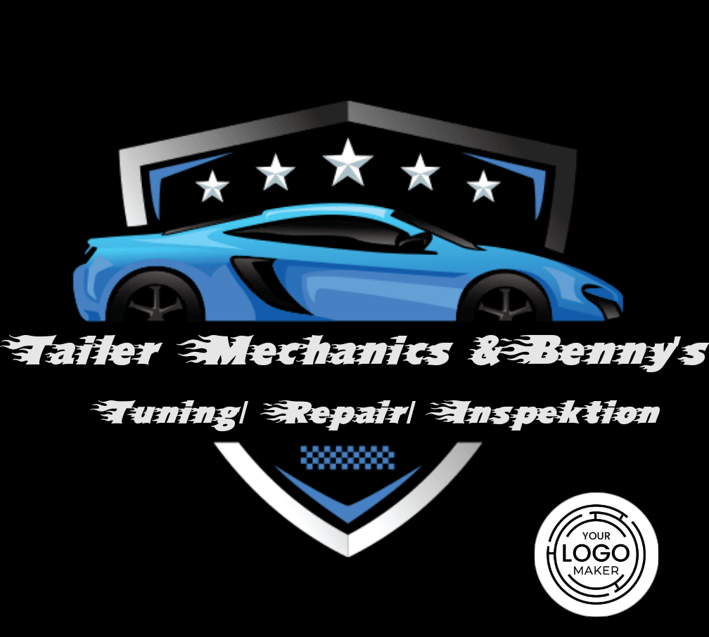

<!-- PROJECT SHIELDS -->

[![Contributors][contributors-shield]][contributors-url]
[![Forks][forks-shield]][forks-url]
[![Stargazers][stars-shield]][stars-url]
[![Issues][issues-shield]][issues-url]
[![MIT License][license-shield]][license-url]
[![LinkedIn][linkedin-shield]][linkedin-url]

<!-- PROJECT LOGO -->
 

  

  <h3 align="center">Daily-Quest-for-Tailer-Mechanics</h3>

  

    A Discord bot for the automatic creation for repairs on a GTAV car for Tailer Mechanics.
     
    <a href="https://github.com/Darkoberd00/daily-quest-for-tailer-mechanics"><strong>Explore the docs »</strong></a>
     
     
    <a href="https://github.com/Darkoberd00/daily-quest-for-tailer-mechanics/issues">Report Bug</a>
    ·
    <a href="https://github.com/Darkoberd00/daily-quest-for-tailer-mechanics/issues">Request Feature</a>
  

<!-- TABLE OF CONTENTS -->

  
Table of Contents

  <ol>
    <li>
      <a href="#about-the-project">About The Project</a>
      <ul>
        <li><a href="#built-with">Built With</a></li>
      </ul>
    </li>
    <li>
      <a href="#getting-started">Getting Started</a>
      <ul>
        <li><a href="#prerequisites">Prerequisites</a></li>
        <li><a href="#installation">Installation</a></li>
      </ul>
    </li>
    <li><a href="#contributing">Contributing</a></li>
    <li><a href="#license">License</a></li>
    <li><a href="#contact">Contact</a></li>
    <li><a href="#acknowledgments">Acknowledgments</a></li>
  </ol>

<!-- ABOUT THE PROJECT -->

## About The Project

The project came from an idea for my GTAV RP situation. My employer gave me every day new orders that I should make. Only the problem is to think of new tasks every day and this is where the bot comes in. I want to have a bot that gives me a task every day with the resources that GTAV has without me having to think of anything.

Here's why:

- Reliable daily incoming tasks.
- Do not think much about what tasks to give.
- And finally a private project again. :smile:

Of course it takes more effort to create such a bot than to think of a task every day. But i had the desire to do such a project and try to put a lot of effort into it. Thanks to all who support the project and give suggestions on extensibility!

(<a href="#readme-top">back to top</a>)

### Built With

This section lists all the major frameworks/libraries that were used to build the project.

- [![Nodejs][Node.js]][Node-url]
- [![npm][npm]][npm-url]
- [![Typescript][Typescript]][Typescript-url]

(<a href="#readme-top">back to top</a>)

<!-- GETTING STARTED -->

## Getting Started

This is an example of how you may give instructions on setting up your project locally.
To get a local copy up and running follow these simple example steps.

### Prerequisites

#### TODO

### Installation

#### TODO

(<a href="#readme-top">back to top</a>)

<!-- CONTRIBUTING -->

## Contributing

Contributions are what make the open source community such an amazing place to learn, inspire, and create. Any contributions you make are **greatly appreciated**.

If you have a suggestion that would make this better, please fork the repo and create a pull request. You can also simply open an issue with the tag "enhancement".
Don't forget to give the project a star! Thanks again!

1. Fork the Project
2. Create your Feature Branch (`git checkout -b feature/AmazingFeature`)
3. Commit your Changes (`git commit -m 'Add some AmazingFeature'`)
4. Push to the Branch (`git push origin feature/AmazingFeature`)
5. Open a Pull Request

(<a href="#readme-top">back to top</a>)

<!-- LICENSE -->

## License

Distributed under the MIT License. See `LICENSE.txt` for more information.

(<a href="#readme-top">back to top</a>)

<!-- CONTACT -->

## Contact

Phil Träger - [@darkoberd00](https://twitter.com/darkoberd00) - darkoberd00@gmail.com

Project Link: [https://github.com/Darkoberd00/daily-quest-for-tailer-mechanics](https://github.com/Darkoberd00/daily-quest-for-tailer-mechanics)

(<a href="#readme-top">back to top</a>)

<!-- ACKNOWLEDGMENTS -->

## Acknowledgments

Use this space to list resources you find helpful and would like to give credit to. I've included a few of my favorites to kick things off!

- [Random Person Generator](https://namefake.com)
- [GTAV vehicle API](https://gta.vercel.app)
- [Discord.js](https://discord.js.org)

(<a href="#readme-top">back to top</a>)

<!-- MARKDOWN LINKS & IMAGES -->
<!-- https://www.markdownguide.org/basic-syntax/#reference-style-links -->

[contributors-shield]: https://img.shields.io/github/contributors/Darkoberd00/daily-quest-for-tailer-mechanics.svg?style=for-the-badge
[contributors-url]: https://github.com/Darkoberd00/daily-quest-for-tailer-mechanics/graphs/contributors
[forks-shield]: https://img.shields.io/github/forks/Darkoberd00/daily-quest-for-tailer-mechanics.svg?style=for-the-badge
[forks-url]: https://github.com/Darkoberd00/daily-quest-for-tailer-mechanics/network/members
[stars-shield]: https://img.shields.io/github/stars/Darkoberd00/daily-quest-for-tailer-mechanics.svg?style=for-the-badge
[stars-url]: https://github.com/Darkoberd00/daily-quest-for-tailer-mechanics/stargazers
[issues-shield]: https://img.shields.io/github/issues/Darkoberd00/daily-quest-for-tailer-mechanics.svg?style=for-the-badge
[issues-url]: https://github.com/Darkoberd00/daily-quest-for-tailer-mechanics/issues
[license-shield]: https://img.shields.io/github/license/Darkoberd00/daily-quest-for-tailer-mechanics.svg?style=for-the-badge
[license-url]: https://github.com/Darkoberd00/daily-quest-for-tailer-mechanics/blob/master/LICENSE.txt
[linkedin-shield]: https://img.shields.io/badge/-LinkedIn-black.svg?style=for-the-badge&logo=linkedin&colorB=555
[linkedin-url]: https://www.linkedin.com/in/phil-träger-60528a200/
[product-screenshot]: images/screenshot.png
[Node.js]: https://img.shields.io/badge/nodejs-339933?style=for-the-badge&logo=nodedotjs&logoColor=black
[Node-url]: https://nodejs.org/
[Typescript]: https://img.shields.io/badge/typescript-3178C6?style=for-the-badge&logo=typescript&logoColor=white
[Typescript-url]: https://typescriptlang.org/
[npm]: https://img.shields.io/badge/npm-CB3837?style=for-the-badge&logo=npm&logoColor=white
[npm-url]: https://npmjs.com/
